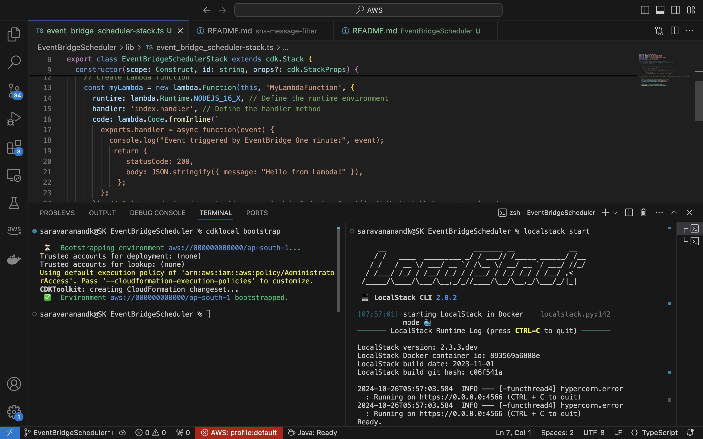
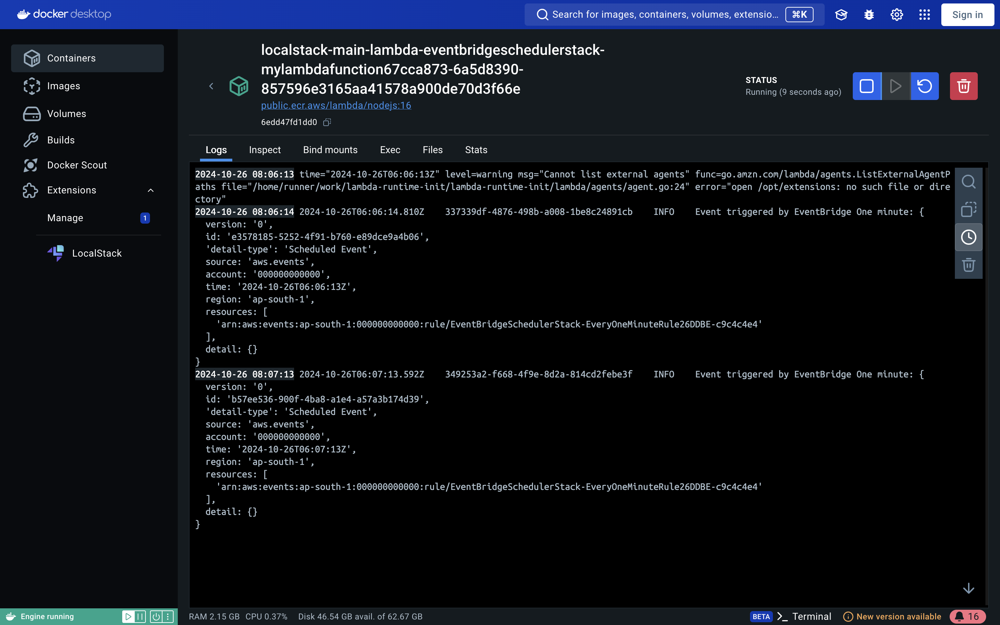

# Trigger Lambda on Schedule using EventBridge

This is a demo project for CDK development with TypeScript integrated with localstack deployment to demonstrate the to trigger lambda on schedule using an EventBridge.

The `cdk.json` file tells the CDK Toolkit how to execute your app.

## Useful commands

* `npm run build`   compile typescript to js
* `npm run watch`   watch for changes and compile
* `npm run test`    perform the jest unit tests
* `cdk deploy`      deploy this stack to your default AWS account/region
* `cdk diff`        compare deployed stack with current state
* `cdk synth`       emits the synthesized CloudFormation template

## Prerequisite
- nodeJs 
- Localstack 
- Docker
- cdklocal
- aws cdk

## Installation
- AWS CDK - https://www.npmjs.com/package/aws-cdk  
- NodeJS - https://nodejs.org/en/download/
- LocalStack - https://github.com/localstack/localst...
- CDKLocal - https://www.npmjs.com/package/aws-cdk...
- AWSLocal -  https://github.com/localstack/awscli-...

Follow the CDK deployment process explained in [this article](https://www.linkedin.com/pulse/aws-cdk-localstack-integration-simplifying-cloud-development-k-btjue/)

> Dont forget to build, bootstrap and synthesis before you deploy your application to localstack.

> Once you deploy the cdk application into localstack you could see from the logs that the lambda gets triggered every 1 minute.

