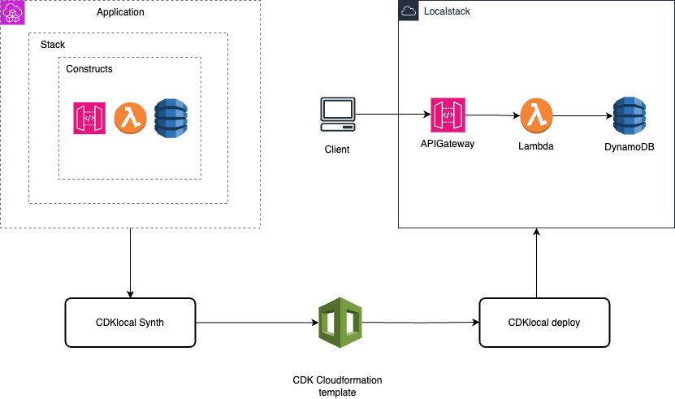

# Welcome to your CDK TypeScript project

This is a demo project for CDK development with TypeScript integrated with localstack deployment.



## Prerequisite
- nodeJs 
- Localstack 
- Docker
- cdklocal 
- awslocal 

## Installation
- AWS CDK - https://www.npmjs.com/package/aws-cdk  
- NodeJS - https://nodejs.org/en/download/
- LocalStack - https://github.com/localstack/localst...
- CDKLocal - https://www.npmjs.com/package/aws-cdk...
- AWSLocal -  https://github.com/localstack/awscli-...


#### once you deployed the stack, find the rest api id using below command

```
aws --endpoint-url=http://localhost:4566 apigateway get-rest-apis --query="items[0].id"
```


#### you can access health  api by hitting the below URL

```
http://localhost:4566/restapis/<rest_api_id>/local/_user_request_/demo
```


